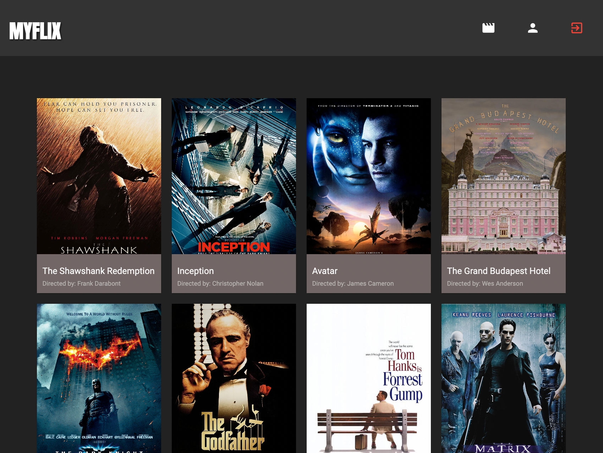

<p align="center">
  
</p>

# 🍿 MyFlix Angular Client

Welcome to the MyFlix Angular Client project! This repository hosts a single-page, responsive movie application built with Angular. The app allows users to browse through a collection of movies, view detailed information about each movie, and manage their user profiles.

## 📝 Project Description

MyFlix Angular Client aims to provide users with an intuitive interface for discovering and exploring movies. The application leverages Angular's powerful features to create a seamless browsing experience, enabling users to navigate through various movie categories, view detailed movie information, and interact with other users through comments and ratings.

## ✨ Features

- User authentication and registration forms.
- Movie browsing by category and genre.
- Detailed movie information including synopsis, director, and genre.
- User profile management and update functionality.
- Adding and removing movies from favorites.
- User comments and ratings for movies.
- Responsive design for optimal viewing across devices.

## 🛠️ Technical Requirements

- Developed in Angular framework (version 9 or later).
- Utilization of Angular Material for UI components.
- Implementation of user registration and login forms.
- Integration with a backend API for movie data and user management.
- Codebase contains comments using Typedoc.
- Technical documentation using JSDoc.
- Hosted on GitHub Pages.

## 🚀 Getting Started

To run this project on your local machine, follow the steps below:

1. **Clone this repository:** Clone this repository to your local machine.

2. **Install dependencies:** Navigate to the project folder in your terminal and run:

```
npm install
```

3. **Start the development server:** Run the following command to start the development server:

```
ng serve --open
```

4. **Open in your browser:** The application should automatically open in your default web browser. If not, navigate to http://localhost:4200/.

Now, you should have the project up and running on your local machine, ready for development and testing.

## 📄 License

This project is licensed under the MIT License - see the [LICENSE](LICENSE) file for details.
